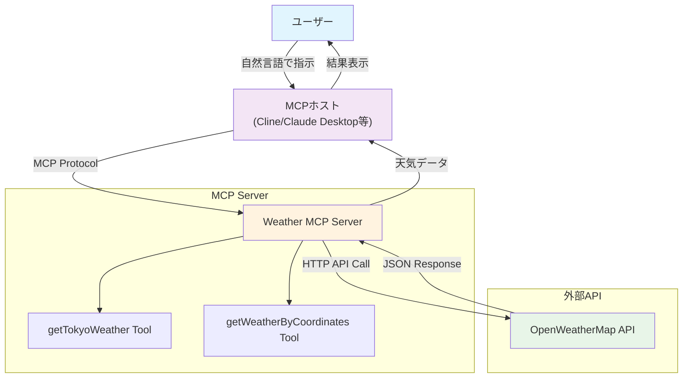

# TypeScript + MCPで作る！天気情報を返すMCPサーバー実装ガイド

## 🎯 この記事について

MCP対応エージェントから使える「天気情報を返すMCPサーバー」をTypeScriptで実装し、実際に動かすまでの手順を紹介します。OpenWeatherMapを使って東京の天気を取得するツールと、緯度・経度を指定して任意の地点の天気を取得するツールを作成します。

**なぜ天気情報MCPサーバーなのか？**

天気情報取得MCPサーバーを作ることは、MCPサーバー実装を理解する最も簡単で安価な手段の一つです。理由として：

- **シンプルなAPI**: OpenWeatherMapは無料枠があり、レスポンスがわかりやすい
- **即座に結果確認**: 天気データは直感的で、動作確認が簡単
- **実用性**: 作ったツールがすぐに日常で使える
- **学習効果**: APIキー管理、HTTPリクエスト、MCP通信の基本が全て学べる

## 🏗️ システム構成



この構成では、ユーザーがMCPホスト（Cline、Claude Desktopなど）に自然言語で指示を出すと、MCPホストがMCPプロトコルを通じて天気MCPサーバーと通信し、最終的にOpenWeatherMap APIから天気データを取得して結果を返します。

## 🧱 使用技術・パッケージ

- TypeScript + Node.js
- MCP公式SDK（`@modelcontextprotocol/sdk`）
- OpenWeatherMap API
- axios, zod

## 📦 OpenWeatherMap APIキーの取得

1. [OpenWeatherMap API](https://openweathermap.org/api) にアクセス
2. 無料アカウントを作成（メール認証が必要）
3. ログイン後、[API Keys](https://home.openweathermap.org/api_keys) に移動
4. `Create key` ボタンを押してキーを生成
5. `.env` ファイルに設定：

```env
WEATHER_API_KEY=あなたのAPIキー
```

## 🗂 プロジェクト構成

```
weather-mcp-sandbox/
├── .clinerules
├── .env
├── .gitignore
├── LICENSE
├── README.md
├── package.json
├── package-lock.json
├── tsconfig.json
└── src/
    └── index.ts
```

## 🛠 パッケージセットアップ

```bash
npm init -y
npm install @modelcontextprotocol/sdk axios zod
npm install -D typescript @types/node
```

## 💻 TypeScript実装

`src/index.ts` に以下のコードを記述：

```typescript
import { McpServer, ResourceTemplate } from "@modelcontextprotocol/sdk/server/mcp.js";
import { StdioServerTransport } from "@modelcontextprotocol/sdk/server/stdio.js";
import axios from "axios";
import { z } from "zod";

const server = new McpServer({
  name: "TokyoWeather",
  version: "1.0.0"
});

const WEATHER_API_URL = "https://api.openweathermap.org/data/2.5/weather";
const API_KEY = process.env.WEATHER_API_KEY;

// 東京の天気を取得するツール
server.tool("getTokyoWeather", 
  {}, 
  async () => {
    try {
      const response = await axios.get(WEATHER_API_URL, {
        params: {
          q: "Tokyo",
          appid: API_KEY,
          units: "metric",
          lang: "ja"
        }
      });
      
      return {
        content: [{
          type: "text",
          text: JSON.stringify({
            都市: response.data.name,
            気温: `${response.data.main.temp}°C`,
            天気: response.data.weather[0].description,
            湿度: `${response.data.main.humidity}%`,
            風速: `${response.data.wind.speed}m/s`
          })
        }]
      };
    } catch (error) {
      return {
        content: [{
          type: "text",
          text: "東京の天気情報の取得に失敗しました"
        }]
      };
    }
  }
);

// 緯度経度で天気を取得するツール
server.tool("getWeatherByCoordinates", 
  { lat: z.number(), lon: z.number() }, 
  async ({ lat, lon }) => {
    try {
      const response = await axios.get(WEATHER_API_URL, {
        params: {
          lat: lat,
          lon: lon,
          appid: API_KEY,
          units: "metric",
          lang: "ja"
        }
      });
      
      return {
        content: [{
          type: "text",
          text: JSON.stringify({
            緯度: lat,
            経度: lon,
            都市: response.data.name,
            気温: `${response.data.main.temp}°C`,
            天気: response.data.weather[0].description,
            湿度: `${response.data.main.humidity}%`,
            風速: `${response.data.wind.speed} m/s`
          })
        }]
      };
    } catch (error) {
      return {
        content: [{
          type: "text",
          text: "指定された座標の天気情報の取得に失敗しました"
        }]
      };
    }
  }
);

const transport = new StdioServerTransport();
server.connect(transport);
```

## 🚀 実行手順

1. TypeScriptをコンパイル：
```bash
npx tsc
```

2. MCPサーバーを起動：
```bash
node src/index.js
```

このツールは標準入力/出力を通じてMCPエージェントと通信します。

## 🔗 MCPホストへのサーバー登録

作成したMCPサーバーをMCPホストで使用するには、設定ファイルに登録する必要があります。今回はClineを例に説明します。

### 1. Clineの設定ファイルの場所

**macOS/Linux:**
```
~/.config/cline/mcp_servers.json
```

**Windows:**
```
C:\Users\{ユーザー名}\AppData\Roaming\cline\mcp_servers.json
```

### 2. 設定ファイルの内容

`mcp_servers.json` に以下のように追加：

```json
{
  "weather-bot": {
    "command": "node",
    "args": ["/path/to/your/weather-mcp-sandbox/src/index.js"],
    "env": {
      "WEATHER_API_KEY": "あなたのOpenWeatherMapAPIキー"
    }
  }
}
```

### 3. 設定のポイント

- **サーバー名**: `weather-bot` は任意の名前です
- **command**: Node.jsを実行するコマンド
- **args**: コンパイル済みのJavaScriptファイルのパス（絶対パス推奨）
- **env**: 環境変数（APIキーなど）

### 4. MCPホストの再起動

設定ファイルを保存後、MCPホスト（Cline）を再起動すると、新しいMCPサーバーが利用可能になります。

### 📌 他のMCPホストでも使用可能

この記事ではClineを例に説明していますが、作成したMCPサーバーは **Claude Desktop** や **その他のMCP対応アプリケーション** でも同様に使用できます。

**Claude Desktopでの設定例:**
```json
{
  "mcpServers": {
    "weather-bot": {
      "command": "node",
      "args": ["/path/to/your/weather-mcp-sandbox/src/index.js"],
      "env": {
        "WEATHER_API_KEY": "あなたのOpenWeatherMapAPIキー"
      }
    }
  }
}
```

MCPプロトコルは標準化されているため、一度作成したサーバーは複数のMCPホストで再利用できるのが大きなメリットです。

## ✅ MCPホストでの使用方法

### `getTokyoWeather`
- 入力: なし
- 出力: 東京の天気情報（JSON）

### `getWeatherByCoordinates`
- 入力: 緯度（lat）、経度（lon）
- 出力: 指定地点の天気情報（JSON）

## 🧪 実際の実行例

今回はMCPホストとしてClineを使用した実行例を紹介します。

### 東京の天気を取得

Clineで「東京の天気を取得して」と指示した結果：

```
ツール: getTokyoWeather
結果: {"都市":"東京都","気温":"23.57°C","天気":"雲","湿度":"73%","風速":"2.06m/s"}
```

### 緯度経度指定での天気取得

Clineで「43.06991899908357, 141.4287354517559 の天気を取得して」と指示した結果：

```
ツール: getWeatherByCoordinates
パラメータ: {"lat": 43.06991899908357, "lon": 141.42875}
結果: {"緯度":43.06991899908357,"経度":141.42875,"都市":"豊平区","気温":"15.99°C","天気":"曇りがち","湿度":"88%","風速":"7.72 m/s"}
```

この例では札幌市豊平区の天気が取得されており、緯度経度から適切に地名を特定して天気情報を返していることが分かります。

## 🔧 実装時のポイント

### zodによる型安全性
`getWeatherByCoordinates` ツールでは、zodスキーマを使用してパラメータの型を定義し、実行時の型安全性を確保しています。

### エラーハンドリング
API呼び出しが失敗した場合、適切なエラーメッセージを返すよう実装しています。

### 日本語対応
OpenWeatherMapの `lang: "ja"` パラメータを使用し、天気の説明を日本語で取得しています。

## 📌 トラブルシューティング

### APIキーエラー
- `.env` ファイルにAPIキーが正しく設定されているか確認
- `process.env.WEATHER_API_KEY` が `undefined` の場合、APIが動作しません

### TypeScriptコンパイルエラー
- `tsconfig.json` で適切なターゲットとモジュールが設定されているか確認

## ✍️ まとめ

MCP SDKとOpenWeatherMapを組み合わせることで、実用的な天気取得ツールを簡単に作成できました。固定都市だけでなく、緯度経度を指定して任意の地点の天気も取得可能になり、ClineなどのMCPクライアントから柔軟に呼び出せるツールとなっています。

MCPプロトコルは様々なAIアプリケーションで採用されている標準的なプラグイン方式で、Node.js + TypeScriptの知識があれば様々なツールを実装できます。一度作成したMCPサーバーは、Cline、Claude Desktop、その他のMCP対応アプリケーションで共通して使用できるため、非常に汎用性が高いです。ぜひ他の用途でも試してみてください！